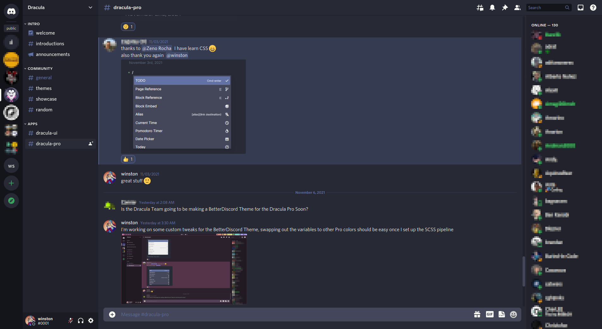

# Dracula for [BetterDiscord](https://betterdiscord.net)

> A dark theme for [BetterDiscord](https://betterdiscord.net).

## Install

All instructions can be found at [draculatheme.com/betterdiscord](https://draculatheme.com/betterdiscord).

## Why this fork?
In contrast to the previous BetterDiscord theme, this uses a Sass build pipeline, which makes swapping out the base colors easy.
In addition, it includes some tweaks requested in some issues ([#11](https://github.com/dracula/betterdiscord/issues/11), [#7](https://github.com/dracula/betterdiscord/issues/7)).
This fork was created for the [Dracula Pro](https://draculatheme.com/pro) colorscheme, but the base colors are not included, since Pro is not open source. You can find the MIT licensed colorscheme build in `./dist/`.

## Team

This theme is maintained by the following person(s) and a bunch of [awesome contributors](https://github.com/dracula/betterdiscord/graphs/contributors).

|  |  |  |
| --- | --- | --- |
| [winston](https://github.com/nekowinston) | [Kabir Kwatra](https://github.com/KabirKwatra) | [Zeno Rocha](https://github.com/zenorocha) |

## License

[MIT License](./LICENSE)
